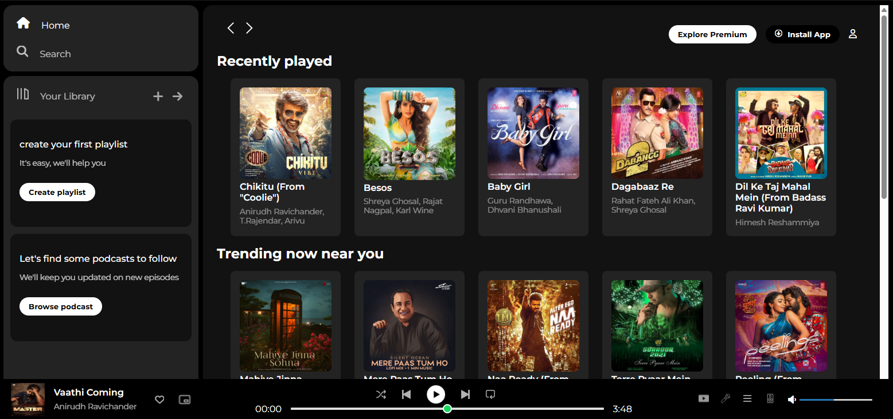

# 🎵 Spotify Clone

A responsive, visually appealing clone of the Spotify Web Player built with **HTML** and **CSS** only.

---

## 🚀 Features

✅ Fully responsive layout  
✅ Sidebar with navigation   
✅ Recently Played and Trending cards  
✅ Music player footer with controls  
✅ Clean, Spotify-inspired design

---

## 🛠️ Built With

- HTML5
- CSS3
- Font Awesome icons
- Google Fonts (Montserrat)

---

## 📸 Screenshots

| Home Page |
|-----------|
|  | 

---

## 🗂️ Folder Structure
```bash
Spotify-Clone/
│
├── assets/ # Images and icons
├── index.html # Main HTML page
└── style.css # CSS styling
```

---

## ⚡ How to Run

1. Clone this repository:
   ```bash
   git clone https://github.com/MirAfaqueAlli/Spotify-Clone
   ```
2. Open `index.html` in your browser.

---

## 💡 Motivation

This project was built to practice **frontend layout skills** by mimicking the look and feel of Spotify's web player using only **HTML and CSS**. It aims to demonstrate:

- Semantic HTML structure
- Modern CSS styling
- Responsive layout techniques

---

## 🙏 Credits

- Spotify for design inspiration
- Font Awesome for icons
- Google Fonts for typography

---

## 📬 Connect with Me

- [LinkedIn](https://www.linkedin.com/in/mir-afaque-alli/)
- [GitHub](https://github.com/MirAfaqueAlli)

---

⭐ If you like this project, feel free to **star** this repo and share your feedback!

---
